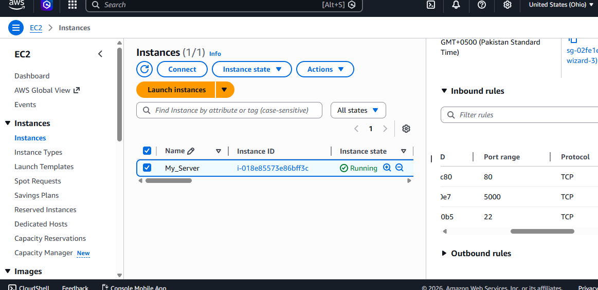
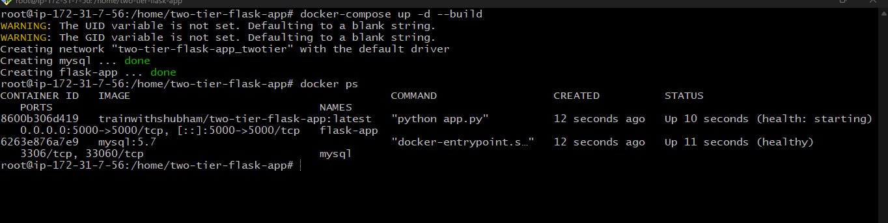
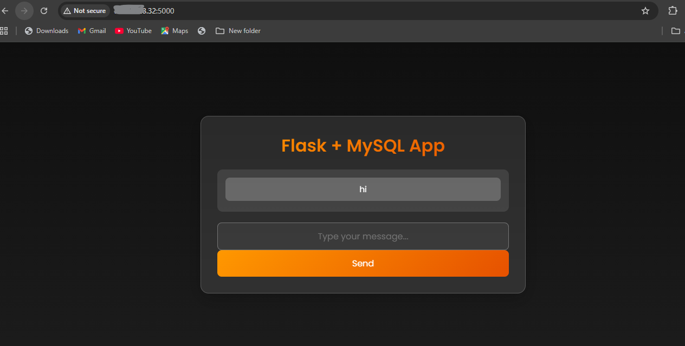

# Two-Tier Flask Application with MySQL using Docker

## 📌 Project Overview

This project demonstrates a **Two-Tier Web Application Architecture** where a Flask web application interacts with a MySQL database. The application allows users to submit messages through a simple web interface, which are then stored in a MySQL database and displayed on the frontend.

The application is fully **containerized using Docker** and can be easily deployed on cloud environments such as AWS EC2.

---

## 🏗️ Architecture

This project follows a **Two-Tier Architecture**:

User → Flask Application (Container) → MySQL Database (Container)

The Flask application handles user requests and communicates with the MySQL database to store and retrieve messages.

---

## ⚙️ Technologies Used

* **Python (Flask)** – Backend web framework
* **MySQL** – Database management system
* **Docker** – Containerization platform
* **Docker Compose** – Multi-container orchestration
* **Linux (Ubuntu Server)** – Server environment
* **AWS EC2** – Cloud deployment platform
* **Git & GitHub** – Version control and repository hosting

---

## ✨ Features

* Submit messages through a web interface
* Store messages securely in a MySQL database
* Retrieve and display stored messages on the frontend
* Containerized architecture using Docker
* Easy deployment using Docker Compose
* Cloud deployment on AWS EC2

---

## 📂 Project Structure

```
two-tier-flask-app
│
├── app.py
├── Dockerfile
├── Dockerfile-multistage
├── docker-compose.yml
├── requirements.txt
├── README.md
│
├── templates
│   └── index.html
│
└── screenshots
    ├── app-ui.png
    ├── docker-containers.png
    ├── aws-deployment.png
```

---

## 🚀 Getting Started

### 1️⃣ Clone the Repository

```
git clone https://github.com/haideralimazari/two-tier-flask-app.git
cd two-tier-flask-app
```

### 2️⃣ Create Environment Variables File

Create a `.env` file and add the following configuration:

```
MYSQL_HOST=mysql
MYSQL_USER=root
MYSQL_PASSWORD=admin
MYSQL_DB=mydb
```

### 3️⃣ Run the Application

Start the containers using Docker Compose:

```
docker-compose up --build
```

This will start two containers:

* Flask Application Container
* MySQL Database Container

---

## 🗄️ Database Setup

Once the containers are running, access the MySQL container:

```
docker exec -it mysql mysql -u root -p
```

Password:

```
admin
```

Create the database table:

```
USE mydb;

CREATE TABLE messages (
id INT AUTO_INCREMENT PRIMARY KEY,
message TEXT
);
```

---

## 🌐 Access the Application

After the containers are running, open the application in your browser:

```
http://localhost:5000
```

If deployed on AWS EC2:

```
http://<EC2-PUBLIC-IP>:5000
```

---

### 🚀 Deployment Screenshots

#### 1. AWS EC2 Instance (Infrastructure)


#### 2. Docker Containers (Services)


#### 3. Working Application (Frontend)


---

## ☁️ Cloud Deployment

This application was successfully deployed on an **AWS EC2 instance** using Docker and Docker Compose. The deployment demonstrates a practical implementation of **cloud-based containerized applications**.

---

## 🧠 Learning Outcomes

Through this project, I gained hands-on experience with:

* Containerizing applications using Docker
* Managing multi-container applications with Docker Compose
* Implementing Two-Tier architecture
* Deploying applications on AWS EC2
* Connecting backend applications with databases

---

GitHub:
https://github.com/haideralimazari